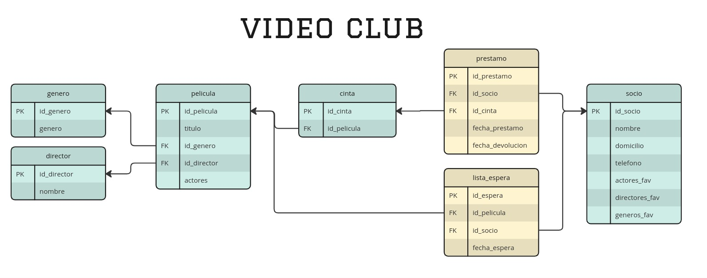

# Desafio SQL - Video Club

---
### Solicitud del cliente:

Se desea diseñar una base de datos relacional que almacene la información sobre los préstamos de las películas de un vídeo club. 

En la actualidad la gestión de esta información se lleva cabo del siguiente modo:

+ Cuando se hace un préstamo se rellena una ficha en la que se anota el socio que se lleva la película, fecha y número de cinta, que es único (de cada película hay varias copias) y fecha de devolución. Esta ficha se deposita en el archivador de películas prestadas.
+ Cuando el socio devuelve la cinta, la ficha se pasa al archivador de películas devueltas. 
+ El vídeo club tiene, además, un archivador con fichas de películas ordenadas por título. Cada ficha tiene además el género de la película (comedia, terror, etc), su director y los nombres de los actores que intervienen.
+ También tiene un archivador con las fichas de los socios, ordenadas por el código que el vídeo club les da cuando les hace el carnet. Cada ficha tiene el nombre del socio, su dirección y teléfono, los nombres de sus directores favoritos, actores favoritos y los géneros cinematográficos de su preferencia.
+ Cuando un socio quiere tomar prestada una película de la que no hay copias disponibles, se le puede anotar en la lista de espera de esa película. Cada vez que se devuelve una película, se comprueba si hay alguien en su lista de espera, y si es así se llama por teléfono al primer socio de la lista para decirle que ya puede pasar a recogerla, borrándolo luego de la lista.

---

### Se requiere:

1. Desarrollar el diagrama entidad-relación correspondiente a la especificación de requisitos (Clic en la imagen para agrandar).

2. Señalar los atributos que son clave primaria y clave foránea, especificando si aceptan nulos.
3. Escribir consultas en lenguaje SQL o en su defecto expresiones regulares para mostrar:
	+ Ranking de películas más alquiladas.
	+ Ranking de clientes que más películas alquilan.
	+ Listado de películas que están en lista de espera y los datos de los socios que las pidieron.
	+ Listado de clientes que no hayan alquilado ninguna película los últimos 90 días.
	+ Listado de cantidad de alquileres por día de semana y género.
	+ Listado de clientes que tienen películas sin devolver y clasificar en prioridad:
		+ “baja” (retraso 3 días o menos),
		+ “media” (retraso entre 3 y 6 días),
		+ “alta” (retraso más de 6 días).

* Puntos 2 y 3, realizados en el [script sql](./scripts/videoclub.sql).

---
**Ezequiel Mettler**
| Data Analyst | [LinkedIn](https://www.linkedin.com/in/ezequiel-mettler/) | [Portfolio Web](https://sites.google.com/view/ezemettler) | Contacto: [ehmettler@gmail.com](mailto:ehmettler@gmail.com)
